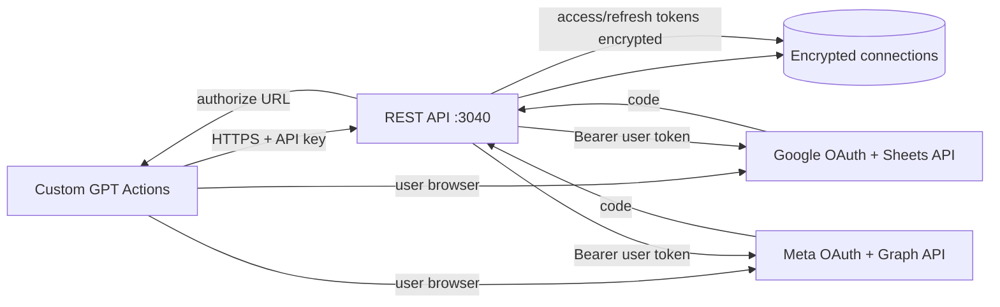

# Two-platform toolkit (mini–Composio)

Small **REST + OAuth2** service for **Google Sheets** and **Instagram (via Meta / Facebook Login)**. Designed so a **Custom GPT** can call predictable JSON endpoints with an **OpenAPI** file pasted into Actions.

**Composio reference (official toolkit documentation):** [Instagram toolkit](https://docs.composio.dev/toolkits/instagram), [Google Sheets toolkit](https://docs.composio.dev/toolkits/googlesheets). Use those pages for upstream tool semantics, permissions, and API quirks; this repo implements a **small subset** behind your own OAuth and **`user_ref`**.

## Architecture (high level)



1. **Connect:** GPT or your UI sends the user to `GET /v1/auth/{google|instagram}?user_ref=...` (public HTTPS base URL required; see `openapi/*.openapi.yaml`).
2. **Callback:** Provider redirects to `GET /v1/auth/{provider}/callback`; server exchanges `code`, **encrypts** tokens, stores row keyed by `user_ref` + `provider`.
3. **Tools:** GPT calls `POST /v1/tools/...` with `user_ref` in JSON + **`X-API-Key`**; server decrypts token, calls Google / Meta, returns a **Composio-shaped** body where helpful: `{ successful, data?, error? }`.

**Instagram note:** There is no separate “instagram.com/oauth2” product URL for Graph publishing. Production apps use **Facebook Login** (Meta) with **Instagram Graph API** permissions on a **Business/Creator** IG account linked to a Facebook Page. Authorize and token exchange live in `src/routes/oauth.ts` + `src/config.ts`.

**Google Sheets note:** OAuth client must have **Google Sheets API** enabled in the same GCP project as the client id/secret. Scopes stay minimal to avoid unverified-app blocks (see `.env.example`).

## One public URL (this folder only)

1. Copy `.env.example` → `.env`, set **`TOOLKIT_PUBLIC_URL`** (no trailing slash), **`PORT`** (default **3040**), keys, OAuth ids.
2. From **`chatgpt_mcp_server/custom-gpt's/two_platform_toolkit`**: **`npm run tunnel`** — stops other **ngrok** processes, builds, starts this server, opens **ngrok** so **`TOOLKIT_PUBLIC_URL`** forwards to **`localhost:$PORT`**. Leave the window open; Enter stops everything.
3. GPT Actions **`servers.url`** = same origin as **`TOOLKIT_PUBLIC_URL`** (see `openapi/toolkit.openapi.yaml` or the split files below).

**OpenAPI:** Maintain **`openapi/toolkit.oauth.openapi.yaml`** and **`openapi/toolkit.tools.openapi.yaml`** separately. **`npm run openapi:bundle`** writes **`servers[0].url`** as **`https://example.com`** (safe to commit). For ChatGPT paste testing with your tunnel baked in, run **`npm run openapi:bundle:paste`** (reads **`TOOLKIT_PUBLIC_URL`** from **`.env`**; works on Windows).

**ChatGPT duplicate domain:** One public host (e.g. ngrok) can only be attached to **one** Custom GPT Action configuration. Do not import the OAuth YAML on one GPT and the tools YAML on another if both would use the same **`TOOLKIT_PUBLIC_URL`** — use the **bundled** **`toolkit.openapi.yaml`** in a **single** GPT (all six operations).

## Folder structure

```text
two_platform_toolkit/
├── README.md
├── package.json
├── tsconfig.json
├── .env.example
├── scripts/
│   └── tunnel.ps1            ← used by npm run tunnel
├── openapi/
│   ├── toolkit.oauth.openapi.yaml   ← OAuth + health + connections (optional separate GPT Actions import)
│   ├── toolkit.tools.openapi.yaml   ← tool POSTs only (optional separate import)
│   └── toolkit.openapi.yaml         ← bundled: paste into Custom GPT for all six operations (`npm run openapi:bundle`)
├── data/                     ← runtime (gitignored): connections.json, oauth-pending.json
└── src/
    ├── server.ts             ← Express, /v1/health, mounts OAuth + tools
    ├── config.ts             ← env + OAuth client config
    ├── crypto/
    │   └── vault.ts          ← AES-256-GCM for tokens at rest
    ├── storage/
    │   └── connections.ts    ← encrypted rows keyed by user_ref + provider
    └── routes/
        ├── oauth.ts          ← /v1/auth/*, /v1/connections
        └── tools.ts          ← POST /v1/tools/* (Sheets + Instagram)
```

## Security checklist

- **Never** return raw access/refresh tokens from listing endpoints; only masked metadata.
- **`TOKEN_ENCRYPTION_KEY`**: 32-byte key, base64-encoded (generate once per deploy).
- **`INTERNAL_API_KEY`**: GPT sends as `X-API-Key`; rotate if leaked.
- Run behind **HTTPS** only in production (ngrok is fine for demos).

## Local operator CLI

This repo includes a local helper CLI at `scripts/toolkit.py` for repeatable `.env` profile management and auth checks.

Examples:

```powershell
.\scripts\toolkit.ps1 profiles add personal --from .env.profiles\personal.env --tenant tenant-e2e --user-ref operator
.\scripts\toolkit.ps1 env use personal
.\scripts\toolkit.ps1 env validate
.\scripts\toolkit.ps1 backend verify --tenant tenant-e2e --user-ref operator
.\scripts\toolkit.ps1 oauth connect --provider google --tenant tenant-e2e --user-ref operator --open
```

You can also run through npm:

```powershell
npm run toolkit -- backend verify --tenant tenant-e2e --user-ref operator
```

Command groups:

- `profiles` (`list`, `show`, `add`, `remove`)
- `env` (`use`, `current`, `diff`, `validate`)
- `backend` (`health`, `debug-config`, `verify`)
- `oauth` (`urls`, `connect`, `status`)
- `run` (`dev`, `tunnel`, `openapi-bundle`, `smoke`)
- `setup` (`wizard`) interactive tenant credential onboarding + optional browser connect
- `doctor` deterministic drift report + exact local fix commands

Wizard example:

```powershell
.\scripts\toolkit.ps1 setup wizard --tenant tenant-e2e --user-ref operator --connect
```

Doctor example:

```powershell
.\scripts\toolkit.ps1 doctor --tenant tenant-e2e --user-ref operator
```

## Possible next steps

1. **Google:** server-side access-token refresh when `expires_at` is near (today errors point you to reconnect).
2. **More tools:** add operations mirroring additional Composio slugs you need; keep **`operationId`** = stable slug.
3. **Storage:** swap `data/*.json` for Postgres without changing the HTTP contract.
4. **Hardening:** rate limits, structured logging, webhook verification if you add Instagram subscriptions.
